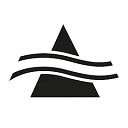

# ioBroker.suedwind-ambientika

**Tests:** 

## suedwind-ambientika adapter for ioBroker

Integration for Südwind Ambientika Smart decentral ventilation systems

### DISCLAIMER

Please make sure that you consider copyrights and trademarks when you use names or logos of a company and add a disclaimer to your README.
You can check other adapters for examples or ask in the developer community. Using a name or logo of a company without permission may cause legal problems for you.

### Getting started

Enter your Username (E-Mailadress) and Password from your Ambientika Login.

Press "+" to add a new device.

Enter the serialnumber of the device you want to add.

If you don't know the serial number, you can search for "VMC-" in your router - enter the serial number without "VMC-" - just the numbers.

For a better overview you can enter also a devicename (e.g. roomname)

By pressing "+" you can add several devices.

In addition you can adapt the refresh rate of the adapter to your needs - dafault is 60 seconds.

The adapter automatically detects Master and Slave devices.

Master devices support changing the Mode, HumidityLevel and FanSpeed.

Those values are read only for Slave devices.

## Support me

## Changelog

### 0.0.2
* (baeriwiliwonka)
- added new object for onlineStatus
- added possibility to reset the Filter (currently untested - doesn't work for Slave devices, needs to be tested on a Master)
- fanSpeed, humidityLevel and operatingMode only writable when device is configured as Master
- disabled filterStaus for Slave devices (need to find out if the resetFilter button doesn't work in general or if this function only works with Master devices. Resetting the Filterstatus in the App only resets the Master and not it's Slaves)

- it is recommended to delete all objects before updating to v0.0.2

### 0.0.1
* (baeriwiliwonka) initial release
- supports multi device handling
- supports reading the status of the device
- supports writing for mode, fanspeed and humidity_level
- refresh intervall can be modified

## License
MIT License

Copyright (c) 2026 baeriwiliwonka <soerenmilimonka@gmx.de>

Permission is hereby granted, free of charge, to any person obtaining a copy
of this software and associated documentation files (the "Software"), to deal
in the Software without restriction, including without limitation the rights
to use, copy, modify, merge, publish, distribute, sublicense, and/or sell
copies of the Software, and to permit persons to whom the Software is
furnished to do so, subject to the following conditions:

The above copyright notice and this permission notice shall be included in all
copies or substantial portions of the Software.

THE SOFTWARE IS PROVIDED "AS IS", WITHOUT WARRANTY OF ANY KIND, EXPRESS OR
IMPLIED, INCLUDING BUT NOT LIMITED TO THE WARRANTIES OF MERCHANTABILITY,
FITNESS FOR A PARTICULAR PURPOSE AND NONINFRINGEMENT. IN NO EVENT SHALL THE
AUTHORS OR COPYRIGHT HOLDERS BE LIABLE FOR ANY CLAIM, DAMAGES OR OTHER
LIABILITY, WHETHER IN AN ACTION OF CONTRACT, TORT OR OTHERWISE, ARISING FROM,
OUT OF OR IN CONNECTION WITH THE SOFTWARE OR THE USE OR OTHER DEALINGS IN THE
SOFTWARE.
